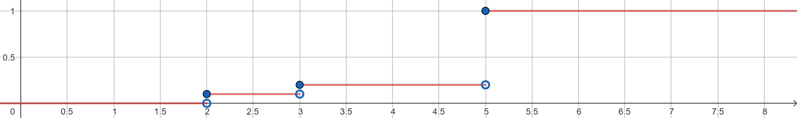

## Problem 1
### Part A
{width=1000px}

$P(2<X\leq4.5)=P(X=3)=\frac{1}{10}$  
$P(2\leq X<4.5)=P(X=2)+P(X=3)=\frac{2}{10}$

### Part B
i. As $X\geq0$, $P(X^2\leq0.25)=P(X\leq0.5)=\frac{1}{2}$
ii. If $a<0$, $P(X^2\leq a)=0$  
If $0\leq a\leq1$, $P(X^2\leq a)=P(X\leq \sqrt a)=\sqrt a$  
If $a>1$, $P(X^2\leq a)=1$
iii. $f(y) = \frac{d}{dy}\sqrt y = \frac{1}{2\sqrt y}$ for $0\leq y\leq1$  
0 otherwise
iv. $E(Y)= \int_{0}^{1} yf(y)\ dy$  
$=\int_{0}^{1} \frac{y}{2\sqrt y}\ dy$  
$=\int_{0}^{1} \frac{\sqrt y}{2}\ dy$  
$=[\frac{1}{3}x^{\frac{3}{2}}]_0^1$  
$=\frac{1}{3}$  

$Var(Y)= \int_{0}^{1} (y-\mu)^2 f(y)\ dy$  
$=\int_{0}^{1} \frac{(y-\frac{1}{3})^2}{2\sqrt y}\ dy$  
$=\int_{0}^{1} \frac12 y^{\frac32} - \frac13 y^{\frac12} + \frac{1}{18} y^{-\frac12} \ dy$  
$=[\frac15 y^{\frac52} - \frac29 y^{\frac32} + \frac19 y^{\frac12}]^1_0$  
$=\frac{4}{45}$

## Problem 2
### Part A
$\because Z \sim i.i.d.\ N(0,1)$  
$\therefore E(X) = E(Z_1^2+\cdots+Z_d^2) = d\cdot E(Z^2)$  
$\because E(Z^2) = Var(Z)+[E(Z)^2] = 1+0 = 1$  
$\therefore E(X) = d\cdot E(Z^2) = d$  

$\because Z \sim i.i.d.\ N(0,1)$  
$\therefore Var(X) = Var(Z_1^2+\cdots+Z_d^2) = d\cdot Var(Z^2)$  
$\because Var(Z^2) = E(Z^4)-[E(Z^2)^2] = 3\sigma^4 - \sigma^4 = 2$  
$\therefore Var(X) = d\cdot Var(Z^2) = 2d$  

https://math.stackexchange.com/questions/620045/mean-and-variance-of-squared-gaussian-y-x2-where-x-sim-mathcaln0-sigma

### Part B
Markov’s calculation on expected speed is correct, but his calculation on expected time is wrong. The expected time is not “distance divided by expected speed”. It is calculated from the time of each event, like below:  
$T_{walk} = \frac{2}{5}$  
$T_{scooter} = \frac{2}{10}$  
$E(T) = 0.4\times \frac{2}{5} + 0.6\times \frac{2}{10} = 0.28$

## Problem 3
$X=F^{-1}(U)$  
$P(X\leq x) = P(F^{-1}(U)\leq x) = P(U\leq F(x)) = F(x)$  
because $P(U\leq u)=u$, when $U$ is uniform on $[0,1]$  
https://en.wikipedia.org/wiki/Inverse_transform_sampling#Proof_of_correctness

## Problem 4
### Part A
$\because X_N \sim Bi(N,P)$  
$E(\hat{p}_N) = E(\frac{X_N}{N}) = \frac{E(X_N)}{N} = \frac{NP}{N} = P$  
$Var(\hat{p}_N) = Var(\frac{X_N}{N}) = \frac{Var(X_N)}{N^2} = \frac{NP(1-P)}{N^2} = \frac{P(1-P)}{N}$  
$sd(\hat{p}_N) = \sqrt{Var(\hat{p}_N)} = \sqrt{\frac{P(1-P)}{N}}$

### Part B
Theoretical $E(\hat{p}_5)=0.5$, $sd(\hat{p}_5) = \sqrt{\frac{0.5\times(1-0.5)}{5}} = 0.2236$  
Simulated mean and sd of $\hat{p}_5$
```{r echo=FALSE}
# Sample 0 and 1 with equal prob 5 times, take average
# Replicate 10000 times
N <- 5
set.seed(167)
p_5 <- replicate(10000, 
                    sample(0:1, N, replace = TRUE)) |>
  colMeans()
mean(p_5)
sd(p_5)
```

```{r echo=FALSE}
# Repeat with different sample sizes
p_sd <- function(N){
  result <- replicate(10000, 
                     sample(0:1, N, replace = TRUE)) |>
    colMeans()
  sd(result)
}
N <- c(5, 10, 25, 50, 100)
set.seed(167)
sd_sim <- sapply(N, p_sd)

# Calculate theoretical s.d.
sd_real <- 0.5 / sqrt(N)

# Plot it
library(ggplot2)
data.frame(N, sd_sim, sd_real) |>
  ggplot(aes(x = N)) +
  geom_point(aes(y = sd_sim, color = "Simulated")) +
  geom_point(aes(y = sd_real, color = "Theoretical")) +
  labs(x = "N",
       y = "Standard deviation",
       color = "")
```

Comment: Standard deviation decreases as $N$ increases.

## Problem 5
$\because Y=\max\{X_1,\dots,X_N\}$  
$\therefore X_i\leq Y$ for all $i=1, \dots, N$  
$F(Y) = P(Y\leq x) = P(X_1\leq x, X_2\leq x,\dots, X_N\leq x)$  
$=P(X_1\leq x)P(X_2\leq x)\cdots P(X_N\leq x)$ (independent)  
$=[P(X\leq x)]^N$ (identical)  
$=[F(X)]^N$  

$\because F(X) = 1- e^{-\lambda x}$  
$\therefore F(Y) = [F(X)]^N = (1- e^{-\lambda x})^N$  
$\therefore f(Y) = \frac{d}{dx} F(Y) = N(1- e^{-\lambda x})^{N-1} \cdot (\lambda e^{-\lambda x})$

https://en.wikipedia.org/wiki/Order_statistic
